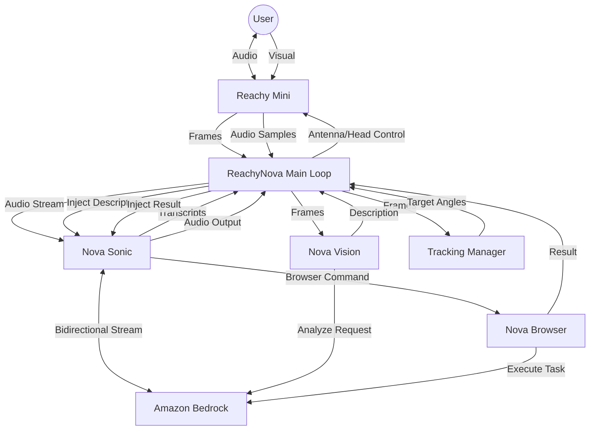

# Architecture Overview

Reachy Nova is a Python application designed for the Reachy Mini robot. It integrates multiple Amazon Nova AI services to create an interactive, multimodal agent that can see, hear, speak, and browse the web.

## High-Level Architecture

The application is structured as a `ReachyMiniApp`, which is the standard way to build applications for Reachy Mini. The main class `ReachyNova` orchestrates the following core components:

1.  **Nova Sonic (Voice)**: Handles bidirectional speech-to-speech communication using Amazon Bedrock's Nova Sonic model.
2.  **Nova Vision (Sight)**: Analysis camera frames using Amazon Bedrock's Nova Pro model to understand the environment.
3.  **Nova Act (Action)**: Performs browser automation tasks triggered by natural language commands using the Nova Act library.
4.  **Tracking Manager**: Fuses audio and visual signals (DoA, Face Detection) to control the robot's head movements.

## Component Interaction

## State Management

The application maintains a shared state dictionary `app_state` protected by a `threading.Lock`. This state tracks:
-   **Voice State**: `idle`, `listening`, `thinking`, `speaking`.
-   **Mood**: `happy`, `curious`, `excited`, `thinking`.
-   **Vision/Browser Status**: Results, descriptions, and current activity.
-   **Tracking Mode**: `idle`, `speaker`, `face`, `snap`.

This state is exposed via a local API (`/api/state`) for the web dashboard.

## Concurrency

The application relies heavily on threading to ensure responsiveness:
-   **Main Thread**: Runs the control loop, managing robot movements and state synchronization.
-   **Nova Sonic Thread**: Manages the persistent WebSocket/HTTP2 stream to Amazon Bedrock.
-   **Nova Vision Thread**: Periodically sends frames for analysis without blocking the main loop.
-   **Nova Browser Thread**: Executes long-running browser automation tasks in the background.
-   **Tracking Listeners**: Run in background threads (via `ultralytics` or `reachy-mini` SDK) to process heavy tracking algorithms.
