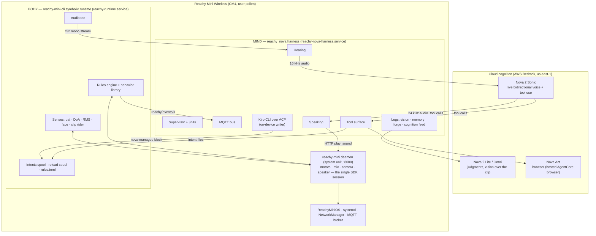
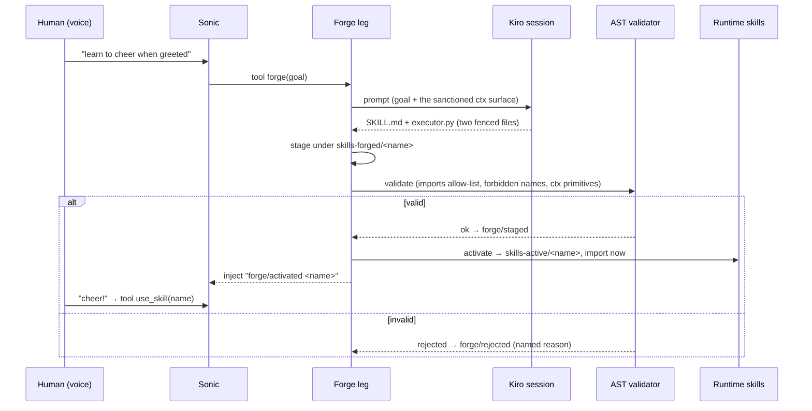

# Reachy Nova — Architecture

> **Who this is for.** Anyone who needs to *understand* how the robot thinks,
> hears, speaks and extends itself — operators, contributors, reviewers — before
> (or instead of) reading code. It is deliberately about concepts, layers and
> communication, not files. When you need the file-level view, follow the links
> at the end into `docs/components/` and the module map in `CLAUDE.md`.
>
> Status: describes the **on-device harness** architecture that has been live
> on the Reachy Mini Wireless since August 2026. The original single-process
> `ReachyMiniApp` design is covered in [§10 Legacy path](#10-the-legacy-path).

---

## 1. The one-sentence model

**The robot has a body that is always alive, and a mind that can come and go.**

- The **body** is `reachy-mini-cli`'s *symbolic runtime* — a 50 Hz, model-free,
  rule-driven presence loop that owns the hardware outright. It breathes,
  orients to sound, reacts to a pat, tracks a face and plays behaviors with
  **zero LLM calls and zero network**.
- The **mind** is `reachy_nova`'s *harness* — a separate process on the same
  computer that attaches to the body through a handful of narrow seams and adds
  cognition: live voice (Nova 2 Sonic), fast judgment and sight (Nova 2 Lite /
  Omni), memory, browsing, and a *writer* (Kiro CLI) that can author new skills
  and rules for the robot at runtime.

Kill the mind and the body keeps living. Kill the network and the mind degrades
by name rather than dying. Two AI minds are never allowed to attach at once.
Everything else in this document is a consequence of those three sentences.

## 2. Layers

```mermaid
flowchart TB
    subgraph cloud["Cloud cognition (AWS Bedrock, us-east-1)"]
        Sonic["Nova 2 Sonic<br/>live bidirectional voice + tool use"]
        Lite["Nova 2 Lite / Omni<br/>judgments, vision over the clip"]
        Act["Nova Act<br/>browser (hosted AgentCore browser)"]
    end
    subgraph device["Reachy Mini Wireless (CM4, user pollen)"]
        subgraph mind["MIND — reachy_nova harness  (reachy-nova-harness.service)"]
            Sup["Supervisor + units"]
            Bus["MQTT bus"]
            Hear["Hearing"]
            Speak["Speaking"]
            Tools["Tool surface"]
            Legs["Legs: vision · memory · forge · cognition feed"]
            Kiro["Kiro CLI over ACP<br/>(on-device writer)"]
        end
        subgraph body["BODY — reachy-mini-cli symbolic runtime  (reachy-runtime.service)"]
            Rules["Rules engine + behavior library"]
            Senses["Senses: pat · DoA · RMS · face · clip rider"]
            Spool["Intents spool · reload spool · rules.toml"]
            Tee["Audio tee"]
        end
        Daemon["reachy-mini daemon (system unit, :8000)<br/>motors · mic · camera · speaker — the single SDK session"]
        OS["ReachyMiniOS · systemd · NetworkManager · MQTT broker"]
    end
    Hear -- 16 kHz audio --> Sonic
    Sonic -- 24 kHz audio, tool calls --> Speak
    Sonic -- tool calls --> Tools
    Legs --> Lite
    Tools --> Act
    Tee -- f32 mono stream --> Hear
    Rules -- reachy/events/# --> Bus
    Tools -- intent files --> Spool
    Kiro -- nova-managed block --> Spool
    Speak -- HTTP play_sound --> Daemon
    Rules <--> Daemon
    Senses <--> Daemon
    Daemon --> OS
```

Read the layers bottom-up:

| Layer | Owns | Talks to |
| --- | --- | --- |
| **OS** (ReachyMiniOS) | boot, `systemd --user` units, Wi‑Fi profiles, local MQTT broker, journald | everything above |
| **Daemon** (`reachy-mini-daemon`, system unit, HTTP :8000) | the *one* SDK/media session: motors, mic, camera, speaker | the runtime (exclusively, for motion + media) and the harness (HTTP playback only) |
| **Body / runtime** (`reachy behavior engine run`) | presence loop, rules, behaviors, senses, spools, audio tee, `reachy/events/#` | daemon below, harness above via seams |
| **Mind / harness** (`python -m reachy_nova.harness run`) | cognition: Sonic, Lite/Omni, memory, browse, Kiro writer, the tool surface | runtime via seams, cloud via HTTPS, Kiro via stdio |
| **Cloud cognition** | the models | the harness only |

## 3. Ownership and the single-owner rule

The Reachy Mini SDK admits **one** client for motors and media. On the Wireless
that client is the runtime, at boot, for as long as the robot is on. Therefore:

- The harness **never opens an SDK client and contains no motion code.** This
  is machine-enforced: a boundary test walks the harness package's AST and
  fails on any `reachy_mini` import or any `set_target` reference.
- The harness never `acquire`s or `release`s the daemon's media session; it
  only *uploads and plays* finished WAV files through the daemon's HTTP API,
  and only *reads* the mic through the runtime's audio tee.
- All motion the mind wants (a nod, a look, a mode change) is **requested** as
  an *intent* and **decided** by the runtime's engine. The engine can refuse,
  and its typed refusal is what the model hears back.
- Two cognition attachments are mutually exclusive. The harness refuses to
  start if `reachy agent embody` is live, claims its own PID file atomically,
  and the systemd units for the runtime and the legacy demo mode `Conflict`
  each other in both directions.

The consequence worth internalising: **the personality survives the mind being
off.** The behaviors that used to live in the Python monolith (breathing,
feel‑alive, pet‑reaction, orient‑to‑sound) were *shed into* the runtime's rule
and behavior library, not deleted, so a robot with no AWS credentials, no
network, or a crashed harness still feels alive.

## 4. The seams — every channel between mind and body

Each seam is narrow, one-directional where possible, and file- or socket-shaped
so it survives either side restarting. Everything file-shaped lives under one
*state directory* (`REACHY_STATE_DIR` → `$XDG_STATE_HOME/reachy` →
`~/.local/state/reachy`), which is the whole filesystem contract.

| Seam | Direction | Shape and meaning |
| --- | --- | --- |
| **MQTT `reachy/events/<source>/<type>`** | body → mind | compact JSON cues (`rule/*`, `intent/*`, `motion/*`, provisional `pat`/`face`/`vision`). Not retained, QoS 0: a cue is a *moment*. |
| **MQTT `reachy/state/online`** (retained, last-will) | body → mind | availability only; never treated as a cue |
| **MQTT `reachy/state/clip`** (retained) | body → mind | `{available, path, ts, duration_s, …}` for the camera clip the rider keeps overwriting in place |
| **MQTT `nova/harness/state`** (retained, last-will) | mind → world (and body) | the harness's own availability `{status: online|offline, ts}` — the runtime's `MindPresence` subscribes to it so a face-lock releases when the mind goes away |
| **Audio tee** (`<state>/audio_tee.sock`, Unix stream) | body → mind | one JSON header line (`format`, `channels`, `samplerate`) then endless float32 mono samples — what the mic hears, post-AEC |
| **Intents spool** (`<state>/behavior/intents/commands/*.json` → `results/<cmd_id>.json`) | mind → body → mind | atomically written op dicts (`run_behavior`, `declare_goal`, `set_mode`, `set_inhibition`, `goto`, enroll); the engine's verdict comes back under the same id |
| **Rules overlay** (`<state>/behavior/rules.toml`, nova-managed block) | mind → body | `[[react]]` rules the mind authored, `nova-` prefixed, inside sentinel markers, merged by id; operator rules outside the block are byte-preserved |
| **Reload spool** (`<state>/behavior/reload/{commands,results}`) | mind ↔ body | "please reload rules" → `CONFIRMED` / `REJECTED` (rejected means the old rules are still live) |
| **Engine heartbeat** (`<state>/behavior/state.json: updated`) | body → mind | monotonic timestamp with a 2 s TTL — the *only* trusted liveness signal (not systemctl, not PID files) |
| **PID claims** (`<state>/embody.pid`, `<state>/nova-harness.pid`) | peers | exclusivity between cognition attachments, verified by exact argv token |
| **Daemon HTTP** (`POST /api/media/sounds/upload` → `play_sound` / `stop_sound`, plus `GET /api/volume/current` / `POST /api/volume/set`) | mind → daemon | complete mono int16 WAV per utterance; `play_sound` returns when playback *starts*, not ends; the volume endpoints back the `raise_voice`/`lower_voice`/`set_voice_level` tools |
| **Persisted volume** (`<state>/nova-volume.json`) | mind (own) | last-set voice level, re-applied to the daemon on harness start when it disagrees |
| **Persisted quiet deadline** (`<state>/nova-quiet.json`) | mind (own) | the timed-quiet `until` epoch, atomically written on every arm/release so a restart inside a quiet window comes back quiet rather than reintroducing itself out loud |
| **Cognition feed** (NDJSON on stdout/journal) | mind → consumers | `{"t": "thinking" / "message" / "emotion", …}` in reachy-mini-cli's export schema, so external displays (e.g. the reTerminal bridge) read it unmodified |
| **Kiro stdio** | mind ↔ writer | newline-delimited JSON‑RPC 2.0 (ACP): `initialize` → `session/new` → `session/prompt` with streamed `session/update` chunks |

A useful mental test for any proposed new feature: *which seam does it use?* If
the honest answer is "none of these, it needs the SDK", it belongs in the
runtime (reachy-mini-cli), not in the harness.

## 5. Inside the mind — how the harness is built

### 5.1 Supervisor and units

The harness is a **supervisor over units**. A unit is anything with
`start(stop_event)` and `stop()`, and every subsystem — bus, hearing, speaking,
each leg, the Kiro session — is one. Composition is a pure function (build the
object graph with no threads and no network, so it is testable off-robot);
then units start in order, each failure is *named and skipped* rather than
fatal, and they stop in reverse.

Three jobs run before any unit, in priority order:

1. **Exclusivity** — refuse outright if another cognition attachment is live.
2. **Identity** — claim the PID file atomically; reclaim a stale one, refuse a
   live sibling.
3. **Observability** — poll the engine heartbeat and log only *transitions*
   (`engine live` / `dropped reason=engine-heartbeat-lost`).

Two supervisor rules that look odd until you have lived through the failure
they prevent:

- **Zero live components is an error exit**, not a quiet idle. An inert
  harness looks healthy to systemd — which is worse than dead.
- **The harness unit is `After=` the runtime but never `Requires=` it.** A
  hard dependency would kill the mind every time the body restarted, turning
  each runtime blip into a silent loss of hearing and voice. Instead each unit
  reconnects to its seam with its own backoff (a drill: runtime offline → tee
  gone → runtime back → reconnected, same PID, ~8 s).

Each unit carries its own watchdog: hearing reconnects to the tee with latched
backoff; the Kiro session has a liveness monitor with capped exponential backoff
and a stuck-prompt deadline; Sonic has a clock-step detector (a ±60 s
wall‑vs‑monotonic jump forces a restart — learned from an NTP correction that
once left a zombie session), a response-liveness watchdog, and a short speaking
watchdog.

### 5.2 The bus — turning body cues into things the mind notices

A subscriber on the local broker listens **only under `reachy/events/`** (never
`reachy/state/`, whose retained values would replay the last pose on every
reconnect as if it had just happened). Each event is keyed `source/type` and
looked up in the **nervous‑system rules** (`config/nervous-system/rules.yaml`),
which assign a priority, an urgency, and an *inject template*. A matching
template renders one sentence and hands it to Sonic's `inject_text`; a missing
template costs exactly one log line. The raw `sense` stream is off by default
— unfiltered it once produced 187 cues in 40 s.

Two more per-entry fields shape *how* a rendered inject reaches the model:
`voice: silent|brief|free` (default `free`) hints how much Nova should say
about the event — never whether it happened — and the bus appends a short
marker to the rendered text for `silent`/`brief`; `sense: <class>` (e.g.
`pat`, `face`, `sound`, `vision`) names the sensory class an entry belongs
to. The bus keys a per-class **dedupe window** (`NOVA_SENSE_DEDUPE_S`,
default 10 s) off that `sense` class when present — so two differently
named rules that fire off the same physical touch or glance collapse into
one inject — and every inject that clears dedupe is also recorded into a
small **sense history** ring buffer (`sense_history.py`), read back by the
`recall_senses` tool so "what did you just feel?" answers from what
actually happened rather than a guess.

An important reality of the live device: discrete senses mostly **collapse
into `sense/snapshot`**; only *rule fires* cross the bus as distinct events.
So for a recognised face to reach the mind at all, the harness upserts one
standing overlay rule (`nova-face-noticed`) into the body's rules at start —
the single deliberate side effect of composition.

### 5.3 Hearing — mic to Sonic

Tee stream → header validated in full (a foreign or rate‑less header is a named
refusal, never a guess) → mid-sample-safe buffering → resample to 16 kHz →
feed Sonic. The tee carries the XVF3800's hardware‑AEC output, which is why
the **echo gate policy defaults to `off`**: the robot can hear you *while it
speaks*, so barge‑in is possible. (A `half-duplex` policy exists for hardware
without AEC; an unknown value fails *open*, because a typo must never deafen
the robot.)

Barge‑in has two arms: Sonic's own (a user transcript while it is generating →
a Lite judgment "is this an interruption?" → preempt), and a playback‑aware arm
in the harness (a user transcript while a playback window is armed means the
human is talking over audible speech → preempt directly).

### 5.4 Speaking — Sonic to speaker

Sonic's 24 kHz audio is buffered **per utterance**, flushed when Sonic leaves
its `speaking` state (or every ~15 s during a monologue), wrapped as WAV,
uploaded, and played through the daemon. Two details carry the correctness:

- The **echo gate is armed before the play request**, not after — a live
  incident had the robot conversing with its own tail.
- A **preempt epoch** is snapshotted when an utterance is dequeued and
  re-checked before the request and after it returns, because `play_sound`
  returns at *trigger* time; without this, an utterance already in the worker's
  hand would replay after a barge‑in cut it.

Any playback HTTP failure clears the gate, purges the queue and fires one
`on_playback_failure` — losing the mouth can never leave the mind stuck in
"speaking".

A timed **quiet gate** (`QuietState`, optional) sits at the very top of this
path: while a quiet deadline is armed, an utterance is dropped there before
any upload, gate arm, or queue touch happens — see
`docs/components/quiet-mode.md`.

### 5.5 The tool surface — what the voice can *do*

Sonic's `toolConfiguration` is the mind's entire action vocabulary:

`run_behavior · declare_goal · set_mode · set_inhibition · goto · create_rule ·
browse · enroll_face · lock_face · release_face · raise_voice · lower_voice ·
set_voice_level · stay_silent · end_silence · recall_senses · forge ·
use_skill · author_rule`

Every call returns exactly one of three shapes — `{"ok": true, …}` with the
engine's result verbatim, `{"ok": false, "error": …}` with a pre‑flight or
engine refusal, or `{"ok": null, "submitted": <cmd_id>}` when the intent is on
disk but unconfirmed within the wait. **No tool call ever silently vanishes.**
Pre‑flight validation is deliberately minimal (unknown tool, malformed args, a
sane `goto` duration); behavior names and joint ranges are *not* re‑validated,
because the engine's own typed refusal names the real catalogue and the model
corrects itself from that.

### 5.6 Legs — optional senses and services

- **Vision leg** — watches the retained clip state, confirms the file still
  exists and its timestamp changed (a retained payload outlives the file it
  names), sends the clip to Omni/Lite, injects one description.
- **Memory leg** — retrieval from the knowledge system, routed through the
  same nervous‑system rules as any other cue.
- **Forge leg** — composes the skill forge, a runtime-only skill manager and
  the standing Kiro session into the `forge` / `use_skill` / `author_rule`
  tools (see §6).
- **Cognition feed** — emits the thinking/message/emotion NDJSON contract.

Each leg is optional and degrades to a single named line
(`component absent name=<leg> reason=<why>`). "We started without seeing" is
visible, never inferred.

## 6. Cognition tiers

The mind is not one model; it is a small hierarchy, each tier with a fixed job
and a fixed trust level.

| Tier | Model | Job | Trust boundary |
| --- | --- | --- | --- |
| **Live voice** | Nova 2 Sonic (`amazon.nova-2-sonic-v1:0`) | bidirectional speech stream, its own ASR, tool use; `inject_text` is the *single pressure valve* every sense passes through (3 s throttle + speaking guard) | speaks and requests intents; never moves anything directly |
| **Fast judgment** | Nova 2 Lite (`us.amazon.nova-2-lite-v1:0`) | barge‑in decision, nervous‑system verdicts, vision fallback; on the current account also carries the clip (`NOVA_OMNI_MODEL_ID` points at Lite) | stateless request/response |
| **Deep multimodal** | Nova 2 Omni (preview; enabled per account) | scene/clip understanding | same as Lite |
| **Action in the world** | Nova Act (hosted AgentCore browser) | `browse` tasks; results route back into speech | off‑robot |
| **Writer** | **Kiro CLI over ACP** (`kiro-cli acp`, agent `nova-writer`, model `minimax-m2.5`, engine v2) | authors *code and rules* for the robot at runtime | **full shell as `pollen`** — a cognition‑tier actor *inside* the harness boundary; it can never become a second owner of the SDK, and its blast radius is the pollen account, not root and not the motors |

### 6.1 The writer: a standing session, not a script

The Kiro writer runs as **one warm ACP session** under the supervisor: spawned
at harness start, watched by a liveness monitor, restarted with capped backoff,
and *recycled* after a bounded number of prompts so its context never grows
without limit. A prompt that overruns its deadline **poisons** the session
(hard‑terminate, respawn) — a hung writer is never allowed to wedge the mind.
Because Kiro authenticates and initialises over the network, its first spawn at
cold boot can fail before Wi‑Fi is up; the supervisor's job is to survive that
and bring it up later, not to give up. So the **initial** spawn is treated like
every later one: a failure never propagates out of `start()` — the unit comes
up *degraded* (no session, watchdog armed, `status()["degraded"] == True`) and
the same capped‑backoff restart path retries until a spawn succeeds. A network
join short‑circuits the wait entirely via `request_restart(reason)`.

### 6.2 The forge pipeline — the robot writing itself a skill

```mermaid
sequenceDiagram
    participant U as Human (voice)
    participant S as Sonic
    participant F as Forge leg
    participant K as Kiro session
    participant V as AST validator
    participant R as Runtime skills
    U->>S: "learn to cheer when greeted"
    S->>F: tool forge(goal)
    F->>K: prompt (goal + the sanctioned ctx surface)
    K-->>F: SKILL.md + executor.py (two fenced files)
    F->>F: stage under skills-forged/<name>
    F->>V: validate (imports allow-list, forbidden names, ctx primitives)
    alt valid
        V-->>F: ok → forge/staged
        F->>R: activate → skills-active/<name>, import now
        F-->>S: inject "forge/activated <name>"
        U->>S: "cheer!"  → tool use_skill(name)
    else invalid
        V-->>F: rejected → forge/rejected (named reason)
    end
```

Principles that hold this together:

- **The validator is the only gate.** It is AST‑only — generated code is never
  imported or executed before it passes — and it fails *closed* if the
  validator itself is missing.
- **Every failure mode lands as `forge/rejected`** — unreachable writer,
  timeout, unparseable reply, validator missing — never an exception on the
  caller's thread, never a blocked loop.
- **No restart to activate.** Forged skills are reached through the generic
  `use_skill` tool, so Sonic's tool list never changes mid‑conversation.

### 6.3 Rule authoring — the robot writing itself a reflex

`author_rule(goal)` asks the writer for exactly one rule in the engine's
schema, then hands it to the **rules overlay**, the only code allowed to touch
`rules.toml`. It validates before touching the file, writes the *whole*
candidate to a temp sibling with operator bytes carried through verbatim,
re‑parses and re‑validates it, atomically replaces, then submits a reload and
**reports the verdict**. A `REJECTED` reload means the old rules are still live
and the tool answers `ok: false` — the robot never believes it has a reflex it
does not have.

## 7. Four walkthroughs

**Someone speaks.** Mic → XVF3800 AEC → runtime → audio tee → hearing unit →
16 kHz → Sonic. Sonic transcribes, thinks, streams audio back → speaking unit
buffers the utterance → WAV → daemon `play_sound`, gate armed → speaker. If the
person talks over it, the transcript during the armed window triggers a
preempt: `stop_sound`, queue purged, epoch bumped.

**Someone pats the robot.** The runtime's pat sense fires `pat-acknowledge` /
`pet-reaction` *by itself* (antennas, lean) — no mind involved. The rule fire
crosses the bus as `rule/fire`; the nervous‑system rules render "you feel
someone petting you…" and inject it; Sonic may say something, and a
Kiro‑authored overlay rule (`nova-pat-cheer`) may also speak. Reactions
compose: body reflex, voice, and authored rule all fire off the same event.

**A face appears.** The runtime's face sense recognises it; the standing
`nova-face-noticed` overlay rule fires → bus → inject → Sonic greets by name.
"Remember me as Ori" → `enroll_face` intent → the runtime's face store learns
it.

**"Forge me a skill."** See §6.2 — the whole loop, including activation, runs
on‑device in seconds, and the result survives harness restarts because it
lives under `~/.reachy_nova/skills-active/`.

## 8. Boot, network and lifecycle

- **Units** (all `systemd --user`, user `pollen`, linger on):
  `reachy-runtime.service` (the body) and `reachy-nova-harness.service` (the
  mind, `After=` runtime + `network-online`). Both are rendered from one tested
  text source by the install script, which also masks the legacy autostart
  unit, gives journald persistent storage with a small cap, and provisions the
  `nova-writer` Kiro agent config. Installing never *starts* the harness —
  turning the mind on is an explicit operator act.
- **Configuration** is environment‑shaped: a `.env` (chmod 600) passed as
  `--env-file` on the unit's `ExecStart` carries AWS credentials, model IDs,
  `FORGE_WRITER=kiro`, `KIRO_*`, `NOVA_*`; runtime tuning such as the pat
  stillness gate is a systemd drop‑in on the runtime unit. A dropped
  `--env-file` flag once silently removed credentials — treat that flag as
  load‑bearing.
- **Network.** The robot keeps several NetworkManager Wi‑Fi profiles with
  autoconnect priorities: the home network first, a phone hotspot as the
  travelling fallback. mDNS is unreliable on this LAN, so operators reach it by
  the registry address (`reachy wireless list`) or a pinned `/etc/hosts` alias.
  When the network is gone the body is unaffected; the mind loses its cloud
  tiers, logs named drops, and reconnects with backoff. The harness has its own
  eyes on this (`harness/network.py`): a 2 s poll of the default route, the
  wlan address and the dispatcher's `network-change` file, latched into one
  `[SENSE stage=supervise … event=network] joined=… / dropped …` line per
  transition. That file is the harness's *only* source for the SSID, so the
  root-side driver (`netfailover.py`) refreshes it whenever the **observed**
  network differs from what it holds — not only after one of its own
  activations, since NetworkManager auto-connects and manual `nmcli` joins
  never pass through the driver. It is never rewritten while disconnected:
  `dropped` is the harness's own route-derived verdict. Every round
  (read → decide → activate → write) is serialised by an `flock` on
  `<state>/netfailover.lock`, because the dispatcher starts one transient
  `--once` unit *per NM event* alongside the long-lived `--loop` unit, and
  overlapping rounds would otherwise share a stale attempt record and storm
  the same SSID. The hook's per-device config (interpreter, state dir, user)
  is rendered by the installer into `/etc/default/reachy-failover`, which the
  hook sources — the values compiled into the hook itself are only the
  reference device's defaults. The unit's FIRST observation is flagged `initial` — it reaches
  the journal (the boot state must be visible) but restarts nothing, since both
  legs were just constructed against that very network. On a **join or move**
  it restarts both cloud legs at once —
  `sonic.request_immediate_restart()` and `kiro_unit.request_restart()` — because
  every open connection is bound to the address that just went away, and Sonic's
  liveness watchdog alone (180 s) cannot meet the 60 s "the mind is back" bound.
  On a **drop** it logs only: the legs' own watchdogs own the offline state, and
  respawning into a dead network only guarantees a failed respawn.
  `After=network-online.target` on the unit is **ordering only** — it is reached
  before wlan0 associates on this device, so the harness must never depend on
  it (no `Wants=`/`Requires=`); the network‑less start is handled in code.
- **Cold boot** has a known wrinkle: the CM4 has no RTC, so early journal
  lines carry the previous shutdown's timestamp until NTP steps the clock —
  which is also why Sonic carries a clock‑step watchdog.
- **Degradation is the resting state.** No broker, no tee, no engine, no AWS,
  no Kiro: each is a named drop and a reconnect loop, never a crash.

## 9. Invariants — the rules you must not break

1. **The harness never opens an SDK client and contains no motion code**
   (AST‑enforced).
2. **One inject path.** Every sense reaches the conversation through the
   nervous‑system rules → plain `inject_text`, preserving throttle and
   speaking guard. Never force past it.
3. **Every failure has a name.** `component absent name=… reason=…`,
   `dropped reason=…` — latched, so a permanently absent camera costs one line
   per condition, not one per tick.
4. **Fail closed on durable artifacts, fail open on policy.** Rules and skills
   refuse rather than guess; echo‑gate and similar policies resolve to their
   safe default on any typo.
5. **Operator bytes are sacred.** The mind owns only its sentinel block in
   `rules.toml`, merged by id.
6. **Cues come from `reachy/events/` only**; `reachy/state/` is state.
7. **No tool call silently vanishes**; every result is one of three shapes.
8. **Every forge/kiro failure lands as `forge/rejected`.**
9. **Cognition attachments are exclusive**; the runtime is the single owner.
10. **Restate, don't import,** across the repo boundary — the harness restates
    only the rules schema it must, pinned in tests so drift is a visible diff.
11. **Quiet mode drops at the speaker, never inside the model; a drop is not a
    playback failure.**

## 10. The legacy path

`reachy_nova/main.py` is the original monolith: a `ReachyMiniApp` that opened
the SDK directly and owned the 50 Hz loop, YOLO tracking, pat detection, wake
word, sleep breathing, gestures, antennas *and* all Nova cognition in one
process. It is **superseded** on the Wireless: its behaviors were shed into the
runtime's library, its autostart unit is masked, and the plan of record retires
it once the harness is proven (it has been). It still shares one artifact with
the harness — the activated‑skills directory — so either path sees the same
forged skills. The USB Reachy Mini on the workstation runs reachy‑mini‑cli
directly with no reachy_nova at all.

## 11. Further reading

- Decisions and plans: `docs/plans/2026-08-09-wireless-cli-harness-scope.md`,
  `docs/specs/2026-08-11-harness-round-2-*.md`,
  `docs/specs/2026-08-19-kiro-writer-pettable-upgrade.md`,
  `docs/deliveries/2026-08-19-kiro-writer-pettable-upgrade.md`
- Trust and security: `docs/security.md`
- Components: `docs/components/skill-forge.md`, `speech-events.md`,
  `nova_sonic.md`, `nova_vision.md`, `patting.md`, `tracking.md`,
  `vocalize.md`, `nova_browser.md`, `nova_memory.md`, `gaze.md`,
  `quiet-mode.md`
- Nervous system rules: `config/nervous-system/rules.yaml`,
  `docs/plans/nervous-system.md`
- File‑level module map: `CLAUDE.md`
